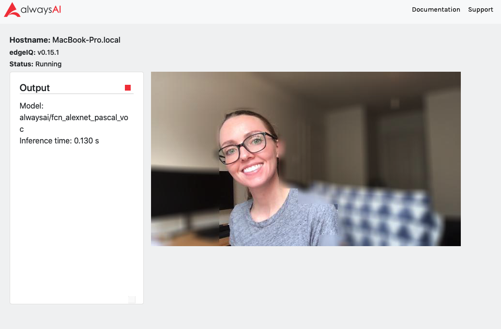
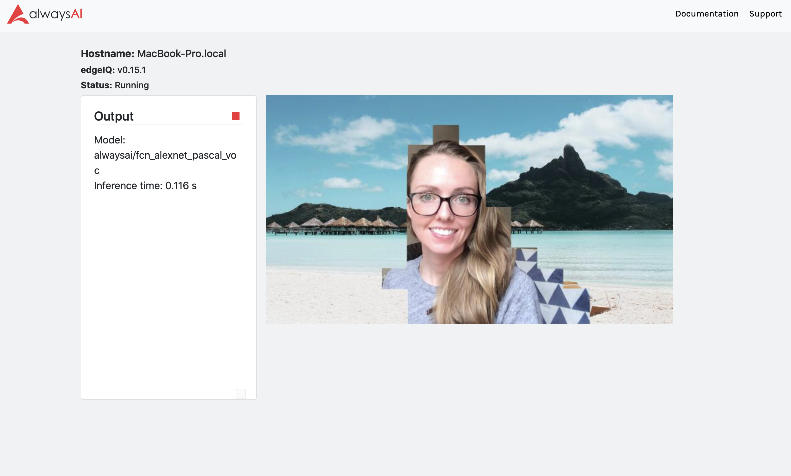

# Virtual Green Screen Example App
This app uses semantic segmentation to segment out a person from background noise in a video stream and replace the background with an image or blur it out. This app builds off of a methodology for segmenting out areas of interested, which can be found [here](https://alwaysai.co/blog/how-to-detect-pedestrians-and-bicyclists-in-a-cityscape-video). This app also demonstrates how to separate your app configuration information into a separate JSON file. For more details on this aspect of the app, please see the [original blog](https://medium.com/@jalakoo_83320/using-a-computer-vision-classifier-to-sort-images-333d5090c0b4).

## Requirements

- [alwaysAI account](https://alwaysai.co/auth?register=true)
- [alwaysAI CLI tools](https://dashboard.alwaysai.co/docs/getting_started/development_computer_setup.html)

## Configuration
This app uses a config.json file to specify different options:
- model_id: specifies the alwaysAI model you'd like to use. Find more details on the available semantic segmentation models [here](https://alwaysai.co/model-catalog/models?category=SemanticSegmentation)
- target_labels: use this variable to pull out desired objects. This will depend on the model you use. While using "alwaysai/fcn_alexnet_pascal_voc", for instance, and wanting to segment out people, the label is 'person'. Add labels you wish to segment out in this list.
- background_images: the folder that stores your possible backgrounds
- image: the name of the image file to use for the background
- blur: whether to blur the background (`true` to blur, `false` to not)
-blur_level: a higher number will blur the background more
- use_background_image: `true` indicates that the background should be replaced with the value set for `image`

## Running
Clone this repository into a desired working directory. Navigate to that directory in the terminal and enter 

`aai app configure`

and follow the propmts to configure your app.

To instead start from scratch using a starter app from alwaysAI and modifying is as described in the original tutorial for this app, create a new project, selecting the `semantic segmentation` model and follow along with this [tutorial](https://alwaysai.co/blog/create-your-own-virtual-green-screen).

Please see this [document](https://alwaysai.co/blog/building-and-deploying-apps-on-alwaysai) for details on building and deploying applications.

## Output
You should see an image such as below if you select 'blur' and no background

And you should see an image such as below if you select no blur and 'use_background_image'

## Troubleshooting
Docs: https://dashboard.alwaysai.co/docs/getting_started/introduction.html

Community Discord: https://discord.gg/alwaysai

Email: support@alwaysai.co

